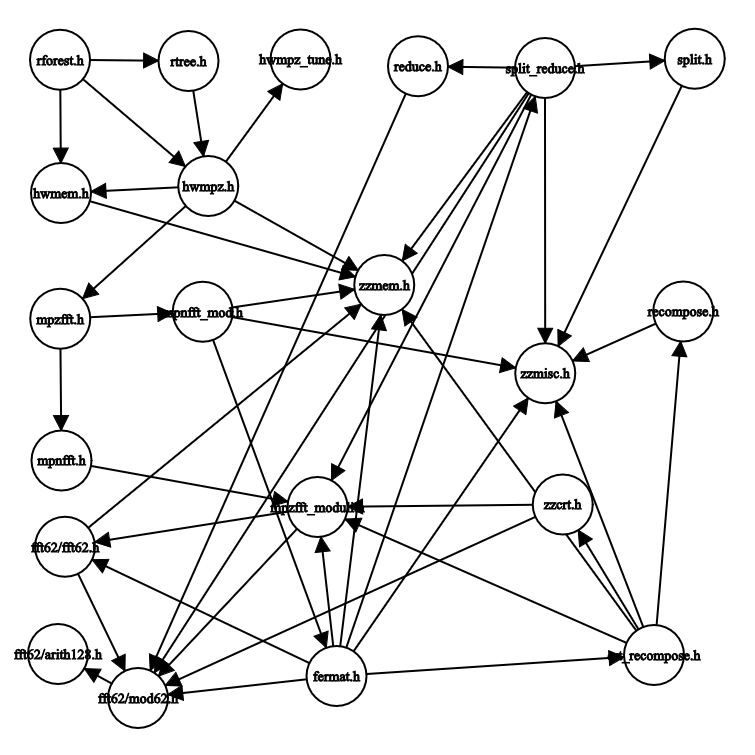

# Repository Structure
Below is a dependency graph of rforest. Edge (A, B) means that A is dependent on B. The graph was generated by 
[this tool](https://csacademy.com/app/graph_editor/), with the list of vertices and edges pasted at the bottom of 
this file.

## Overview of Files
Here is a summary of what each header file and corresponding source file 
implements, in no particular order.

- `r_forest.h`: Exports main function `rforest`
- `hwmem.h`: Handles memory allocation and freeing. Exists moreso 
to be able to track memory usage in debugging, when `HW_MEM_TRACKING` 
isnt enabled most functions are just wrappers around `malloc()` 
and `free()`
- `zzmem.h`: Same as `hwmem.h` - just wrappers around `malloc()` and `free()`
- `hwmpz.h`: Everything to do with mpz vector and matrix operations.
- `mpzfft.h`: Convenient wrapper functions around functions that do actual work in `mpnfft.h`
- `mpnfft.h`: Bridge between integer and polynomial arithmetic.
Contains structs for fft parameters, as well as polynomial 
representations of integers.
- `mpnfft_mod.h`: Honestly not sure what this file does
- `fermat.h`: Bunch of stuff I don't understand but seems to 
perform fast modular multiplication (mod very large numbers).
- `split_reduce.h`: Wrapper combining functionality of `split.h` and `reduce.h`
- `split.h`: also not really sure
- `reduce.h`: also not really sure
- `crt_recompose.h`: Wrapper combining functionality of `zzcrt.h` and `recompose.h`
- `zzcrt.h`: Performs crt
- `recompose.h`: also not really sure
- `zzmisc.h`: Implements gcd
- `mpzfft_moduli.h`: Contains all information about FFT primes - like precomputed fft roots
- `fft62/fft62.h`: FFT
- `fft62/mod62.h`: 62-bit modular arithmetic
- `hwmpz_tune.h`: Crossover things for truncated FFT
- `rtree.h`: Builds remainder tree

## Optimization Plan
The method we want to speed up most is `mpz_rmatrix_mult_fft()` 
in `hwmpz.c`, which performs a matrix multiplication between matrices 
of `mpz_t`. First, we need to familiarize ourselves with the interface for 
terminology for this specific FFT implementation. Then, we can understand 
`mpz_rmatrix_mult_fft()` without any hiccups.

The struct `zz_mpnfft_params_t` holds the most foreign information (to 
somebody who understands the FFT but not the TFT). It holds the unfamiliar 
values `terms`, `r`, and `points`. 
- `terms` is the number of terms we need to add together when doing the 
matrix multiplication algorithm. So, when matmul is called, `terms = d`, 
the number of columns of the first matrix.
- `r`: not sure tbh
- `points` is the smallest convolution length needed - so the first 
`points` values of the result of the FFT are useful, and the rest aren't ( 
will be 0). nextpow2(points) will always be the FFT length.

Now, we can start breaking down `mpz_rmatrix_mult_fft()`
Following is a detailed description of what it does:

Input: Takes in pointers to 3 matrices of `mpz_t`'s (A, B, C) and dimensions 
(r, d). A is a r x d matrix, B is a d x d matrix, and C is a r x d matrix.

Output: C

Steps:
- Computes max bits required to store maximum value in resulting matrix. 
Iterates over both matrices to find the maximum number (specifically, 
the number of limbs required to store the maximum number), then 
returns 64(2 * max_limbs + 1), with the +1 covering extra bits from 
additions.

- Initializes FFT parameters with `zz_mpnfft_params_init()`. Note that all 
FFTs in one run of this function are the same size.

- `AT = hw_malloc(r*d*sizeof(mpzfft_t))`
    - Allocates space for array of `mpzfft_t`'s corresponding to A. No 
    meaningful data yet.
        - `mpzfft_t`: contains a pointer to parameters `(zz_mpnfft_params_t)`, `size`, and 8 pointers (uint64_t* data[8]) to arrays. If data[0] == NULL, then no space allocated yet. `size` 
        is the number of meaningful FFT values, similar to `points`, but `size` is the number of meaningful values BEFORE the convoulution.
        - mpzfft_init sets data[0] = NULL for any mpzfft_t passed in.

- Next 2 steps are run in a loop for every single number in both arrays.

- mpzfft_fft
    - if integer is negative or zero, do nothing
    - else, convert integer op to polynomial with 
        - `zz_mpnfft_mpn_to_poly()`: Takes in a `mpzfft_t` destination `p`, 
        a pointer to the limbs of a number `up`, and the number of limbs `un`. Finds
        `size`, number of coefficients written to for input to FFT. Passes 
        `p->data`, `size`, `up`, `un`, and `r` to `zz_split_reduce()`
        - `zz_split_reduce`: 
- matmul:
    - Works exactly like you would expect matmul to work.
    - Standard matrix multiplication but elements are vectors, multiplication is component-wise multiplication, 
    addition is component-wise addition. Method is only so long because some cache-aware programming is done
- ifft:
    - 

crt.h
crt_recompose.h
fermat.h
fft62/arith128.h
fft62/fft62.h
fft62/mod62.h
hwmem.h
hwmpz.h
hwmpz_tune.h
mpnfft.h
mpnfft_mod.h
mpzfft.h
mpzfft_moduli.h
recompose.h
reduce.h
rforest.h
rtree.h
split.h
split_reduce.h
zzcrt.h
zzmem.h
zzmisc.h

rforest.h hwmem.h 
rforest.h hwmpz.h 
rforest.h rtree.h

hwmem.h zzmem.h

hwmpz.h hwmem.h 
hwmpz.h hwmpz_tune.h 
hwmpz.h mpzfft.h 
hwmpz.h zzmem.h 

rtree.h hwmpz.h

mpzfft.h mpnfft.h 
mpzfft.h mpnfft_mod.h

mpnfft.h mpzfft_moduli.h
mpnfft_mod.h fermat.h 
mpnfft_mod.h zzmisc.h 
mpnfft_mod.h zzmem.h

mpzfft_moduli.h fft62/fft62.h 
mpzfft_moduli.h fft62/mod62.h

fermat.h mpzfft_moduli.h 
fermat.h zzmisc.h 
fermat.h split_reduce.h 
fermat.h crt_recompose.h 
fermat.h fft62/fft62.h 
fermat.h fft62/mod62.h 
fermat.h zzmem.h

fft62/fft62.h fft62/mod62.h 
fft62/fft62.h zzmem.h

fft62/mod62.h fft62/arith128.h

split_reduce.h mpzfft_moduli.h 
split_reduce.h fft62/mod62.h 
split_reduce.h split.h 
split_reduce.h reduce.h 
split_reduce.h zzmisc.h 
split_reduce.h zzmem.h

crt_recompose.h mpzfft_moduli.h 
crt_recompose.h zzcrt.h 
crt_recompose.h recompose.h
crt_recompose.h zzmisc.h 
crt_recompose.h zzmem.h

split.h zzmisc.h

reduce.h fft62/mod62.h

zzcrt.h mpzfft_moduli.h 
zzcrt.h fft62/mod62.h

recompose.h zzmisc.h